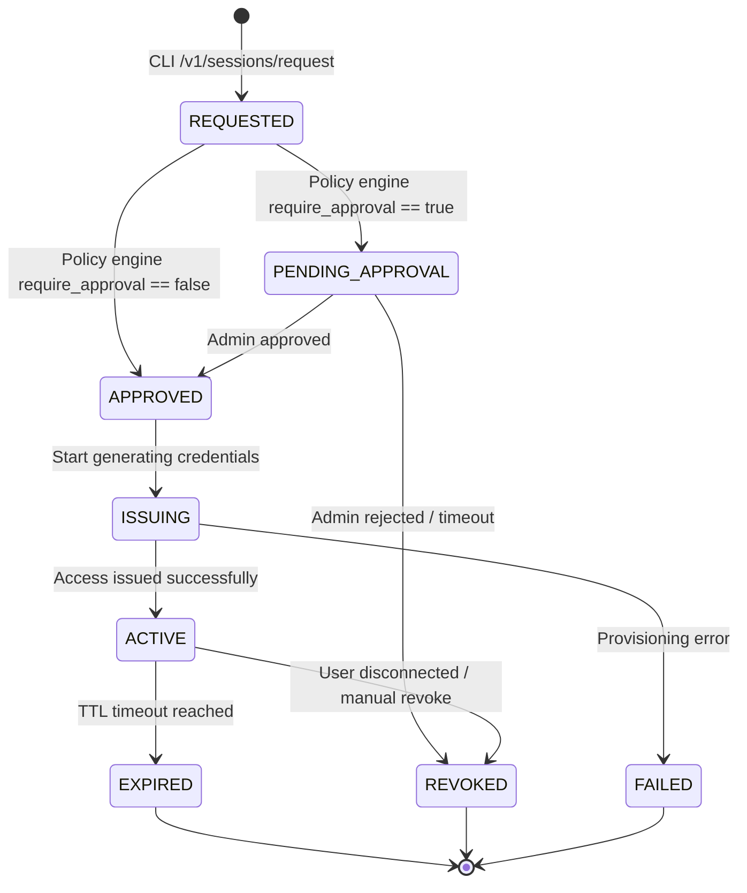

# ephem — Centralized Ephemeral Access Broker

> **"ephem (from *ephemeral*) is a centralized access broker that issues short-lived infrastructure access on demand."**
>
> **Slogan:** "Infrastructure access, issued on demand."  
> **Secondary Slogan:** "Never distribute credentials. Issue them."  
> **Status:** Architecture Frozen  
> **Language:** Go  
> **CLI Binary:** `ephem`  
> **Repository:** `ephem-centralized-access-broker`

---

## İçindekiler

1. [Sistem Genel Bakış](#1-sistem-genel-bakış)
2. [Mimari Tasarım](#2-mimari-tasarım)
3. [Bağlantı Katmanı (Connectivity Layer) & Agent Mimarisi](#3-bağlantı-katmanı-connectivity-layer--agent-mimarisi)
4. [Veri Modeli](#4-veri-modeli)
5. [Provider Sistemi (Plugin Architecture)](#5-provider-sistemi-plugin-architecture)
6. [Session State Machine](#6-session-state-machine)
7. [Policy Engine & Approval Workflow](#7-policy-engine--approval-workflow)
8. [Audit & Logging](#8-audit--logging)
9. [CLI Tasarımı (Proxy & Exec Mode)](#9-cli-tasarımı-proxy--exec-mode)
10. [Git Workflow & Branching Stratejisi](#10-git-workflow--branching-stratejisi)
11. [Aşamalı Geliştirme Planı (v1.0 Core & v1.x Roadmap)](#11-aşamalı-geliştirme-planı-v10-core--v1x-roadmap)

---

## 1. Sistem Genel Bakış

**ephem**, mühendislerin production sistemlerine doğrudan kalıcı credential depolamadan veya standing access vermeden, RBAC ve Approval Workflow tabanlı geçici (ephemeral) altyapı erişimi almasını sağlayan merkezi bir access broker'dır.

### Temel Prensipler

| Prensip | Açıklama |
|---|---|
| **Zero Standing Privileges** | Kalıcı credential veya yetki yok. Her erişim süreli ve otomatik olarak geri alınır (revoke). |
| **Centralized Auth** | OIDC login tabanlı merkezi kimlik doğrulama. |
| **Resource Registry** | "Neye erişilecek?" sorusunu merkezi ve esnek etiketlerle (labels) yöneten registry. |
| **Provider Agnostic** | Her hedef sistem dinamik bir `Provider` plugin registry üzerinden entegre olur. |
| **No Password Persistence** | Üretilen şifreler/Secret'lar veritabanında veya audit loglarda asla saklanmaz. |
| **CLI Proxy & Convenience Commands** | Kullanıcı `ephem exec` proxy komutunu kullanabileceği gibi, `ephem postgres <env>` gibi kısa yollarla da erişim sağlar. |
| **Operational Doctor** | Geliştirme ve işletme kolaylığı için `ephem doctor` komutu ile sistem sağlığını denetleme. |

### Yüksek Seviye Akış (CLI Exec & Auto-Revoke)

```
$ ephem postgres production
      │
      ▼
(CLI arkada "ephem exec postgres-production -- psql" çağırır)
      │
      ▼
CLI → POST /v1/sessions/request  (JWT ile authenticate, resource: postgres-production)
      │
      ▼
API Server
  ├─ JWT & RBAC Kontrol   →  Policy Engine (etiket ve glob kuralları)
  ├─ Provider Registry    →  PostgreSQL Provider (Local / Agent)
  │     └─ CREATE ROLE temp_XXXXX VALID UNTIL NOW()+30m
  │     └─ GRANT readonly TO temp_XXXXX
  ├─ IssueResponse Dön (Session DB'ye şifre yazılmaz, payload binary döner!)
  └─ Session DB Kaydı     →  Status: ACTIVE (Otomatik revoke için DB polling)
      │
      ▼
CLI → Env set et (PGPASSWORD=temp_pass) -> Spawn child process: `psql -h host -U temp_XXXXX`
      │
      ▼
[Kullanıcı psql'den çıkınca veya Süre Dolunca]
CLI/Scheduler → POST /v1/sessions/:id/revoke -> DROP ROLE temp_XXXXX
```

---

## 2. Mimari Tasarım

### Bileşenler

```
                 +-----------------------------+
                 |         ephem-api           |
                 +-----------------------------+
                 | Auth (OIDC)                 |
                 | Policy Engine               |
                 | Session Manager             |
                 | Resource Registry           |
                 | Provider Registry           |
                 | Audit Store                 |
                 +-------------+---------------+
                               |
                 +-------------+-------------+
                 |                           |
          PostgreSQL Provider         Kubernetes Provider
                 |                           |
          Resource Config            Resource Config
                 |                           |
            Target System             Target System
```

- **Resource Registry**: Hangi hedeflere (db, k8s, ssh) erişilebileceğini, sahiplerini (`owner_team`) ve PCI / kritiklik gibi etiketlerini yönetir.
- **Session Manager**: Oturum durumlarını (Session State Machine) yönetir. Parolaları saklamaz, sadece metadata ve expire sürelerini tutur.
- **Provider Registry**: Dinamik olarak kayıt edilen (plugin tabanlı) provider'ları yönetir.
- **Policy Engine**: Roller ve kaynak etiketleri (labels) üzerinden erişim kurallarını denetler.

---

## 3. Bağlantı Katmanı (Connectivity Layer) & Agent Mimarisi

ephem, kontrol düzlemi ile hedef sistemler arasındaki bağlantıyı doğrudan üstlenmez. Tamamen **"Bring Your Own Connectivity"** felsefesini benimser.

```
           +--------------------+
           |     ephem API      |
           +---------+----------+
                     |
             Provider Interface
                     |
        +------------+------------+
        |                         |
 Local Provider            Remote Provider
        |                         |
   Tunnel/VPN                gRPC Agent (ephem-agent)
        |                         |
        +------------+------------+
                     |
              Target Resource
```

ephem API sadece şunu bilir: **Provider hedef kaynağa ulaşabiliyor mu?** 

Kullanıcının ve kurumun kullandığı altyapıya göre bu bağlantı şunlardan biri olabilir:
- **Cloudflare Tunnel**
- **WireGuard / Tailscale / NetBird**
- **AWS PrivateLink / MPLS / IPSec VPN**
- **ephem-agent (gRPC + mTLS)**

---

## 4. Veri Modeli

### users
```sql
CREATE TABLE users (
  id          UUID PRIMARY KEY DEFAULT gen_random_uuid(),
  email       TEXT NOT NULL UNIQUE,
  name        TEXT,
  provider    TEXT NOT NULL,  -- github | google | oidc
  external_id TEXT NOT NULL,
  created_at  TIMESTAMPTZ DEFAULT NOW()
);
```

### roles
```sql
CREATE TABLE roles (
  id   UUID PRIMARY KEY DEFAULT gen_random_uuid(),
  name TEXT NOT NULL UNIQUE  -- admin, developer, dba, devops
);
```

### user_roles
```sql
CREATE TABLE user_roles (
  user_id UUID REFERENCES users(id) ON DELETE CASCADE,
  role_id UUID REFERENCES roles(id) ON DELETE CASCADE,
  PRIMARY KEY (user_id, role_id)
);
```

### provider_configs
```sql
CREATE TABLE provider_configs (
  id                    UUID PRIMARY KEY DEFAULT gen_random_uuid(),
  provider              TEXT NOT NULL,               -- e.g., 'postgres', 'mysql', 'aws'
  host                  TEXT,
  port                  INTEGER,
  database              TEXT,
  authentication_method TEXT NOT NULL,               -- 'password' | 'iam' | 'tls' | 'agent' | 'vault'
  config_extra          JSONB,                       -- Ek metod verileri (örn. AWS role ARN)
  created_at            TIMESTAMPTZ DEFAULT NOW(),
  updated_at            TIMESTAMPTZ DEFAULT NOW()
);
```

> **Güvenlik Notu:** `authentication_method = 'agent'` veya `'vault'` seçildiğinde, admin şifreleri ephem veritabanında **hiçbir şekilde saklanmaz**. ephem API admin credential'ı bilmek zorunda kalmaz, erişimi doğrudan hedef ortamda koşan agent veya merkezi Vault üzerinden delege eder.

### resources (Resource Registry)
```sql
CREATE TABLE resources (
  id           UUID PRIMARY KEY DEFAULT gen_random_uuid(),
  provider     TEXT NOT NULL,
  name         TEXT NOT NULL UNIQUE,       -- e.g., 'postgres-production'
  display_name TEXT,
  config_id    UUID REFERENCES provider_configs(id) ON DELETE RESTRICT,
  environment  TEXT NOT NULL,               -- e.g., 'production', 'staging'
  owner_team   TEXT,                        -- e.g., 'data-team'
  labels       JSONB,                       -- e.g., {"pci": "true", "critical": "true", "region": "eu-central"}
  enabled      BOOLEAN DEFAULT TRUE,
  created_at   TIMESTAMPTZ DEFAULT NOW()
);
```

### policies
```sql
CREATE TABLE policies (
  id            UUID PRIMARY KEY DEFAULT gen_random_uuid(),
  role_id       UUID REFERENCES roles(id) ON DELETE CASCADE,
  resource_glob TEXT NOT NULL,              -- e.g., 'postgres-staging-*', 'postgres-production'
  effect        TEXT NOT NULL,              -- ALLOW | DENY
  conditions    JSONB                       -- { "max_duration": "1h", "require_approval": true }
);
```

### sessions (Oturumlar - Hassas Veri DB'ye Yazılmaz)
```sql
CREATE TABLE sessions (
  id           UUID PRIMARY KEY DEFAULT gen_random_uuid(),
  user_id      UUID REFERENCES users(id) ON DELETE RESTRICT,
  resource_id  UUID REFERENCES resources(id) ON DELETE RESTRICT,
  provider     TEXT NOT NULL,
  issued_at    TIMESTAMPTZ,
  expires_at   TIMESTAMPTZ,
  revoked_at   TIMESTAMPTZ,
  status       TEXT NOT NULL DEFAULT 'REQUESTED', -- REQUESTED, PENDING_APPROVAL, APPROVED, ISSUING, ACTIVE, FAILED, EXPIRED, REVOKED
  approved_by  UUID REFERENCES users(id),
  approved_at  TIMESTAMPTZ,
  metadata     JSONB                       -- Oturumun geçici kullanıcı adı gibi hassas olmayan meta-verileri (örn: {"db_role": "ephem_u_123"})
);
```

### audit_logs
```sql
CREATE TABLE audit_logs (
  id            BIGSERIAL PRIMARY KEY,
  user_id       UUID REFERENCES users(id),
  session_id    UUID,
  action        TEXT NOT NULL,              -- login | request_session | approve_session | revoke_session | deny
  resource_name TEXT,                       -- Denormalize resource ismi (hızlı arama için)
  result        TEXT NOT NULL,              -- SUCCESS | DENIED | ERROR
  reason        TEXT,
  ip_address    INET,
  created_at    TIMESTAMPTZ DEFAULT NOW()
);
```

---

## 5. Provider Sistemi (Plugin Architecture)

Her altyapı kaynağının sunduğu erişim modeli farklıdır (şifre, sertifika, AWS token vb.). Bu nedenle provider'lar ham binary payload döner.

### Interface

```go
package provider

import (
	"context"
	"time"
)

type SessionType string

const (
	SessionTypeDBCredentials SessionType = "db_credentials" // JSON payload: {"username": "...", "password": "..."}
	SessionTypeKubeconfig    SessionType = "kubeconfig"     // YAML kubeconfig dosyası
	SessionTypeSSHCert       SessionType = "ssh_cert"       // SSH Private Key & Signed Certificate
	SessionTypeToken         SessionType = "token"          // AWS STS vb. API token
)

type IssueResponse struct {
	ExpiresAt time.Time   `json:"expires_at"`
	Type      SessionType `json:"type"`
	Payload   []byte      `json:"payload"` // Her tip için özel byte dizisi (şifrelenmemiş/bellekte)
}

type IssueRequest struct {
	SessionID string
	Username  string
	Duration  time.Duration
}

type Provider interface {
	Name() string
	IssueSession(ctx context.Context, req IssueRequest, config []byte) (*IssueResponse, error)
	RevokeSession(ctx context.Context, metadata []byte, config []byte) error
}
```

### Dinamik Registry Mekanizması

API başlatılırken aktif provider'lar registry'e kaydedilir.

```go
package provider

import "fmt"

type Registry struct {
	providers map[string]Provider
}

func NewRegistry() *Registry {
	return &Registry{providers: make(map[string]Provider)}
}

func (r *Registry) RegisterProvider(p Provider) {
	r.providers[p.Name()] = p
}

func (r *Registry) Get(name string) (Provider, error) {
	p, ok := r.providers[name]
	if !ok {
		return nil, fmt.Errorf("provider not found: %s", name)
	}
	return p, nil
}
```

---

## 6. Session State Machine

Erişim oturumunun yaşam döngüsü ve olası hata/onay durumları aşağıdaki gibidir:



---

## 7. Policy Engine & Approval Workflow

### Policy Karar Akışı

1. Kullanıcı `ephem postgres production` komutunu çalıştırır.
2. API, kullanıcının rollerini çeker.
3. Policy Engine, roller için tanımlı olan policy'leri ve `resource_glob` değerlerini eşleştirir.
4. Eşleşen kurallardan `DENY` olan varsa anında reddedilir.
5. `ALLOW` kuralı varsa, etiket bazlı koşullar (`conditions`) incelenir:
   ```json
   {
     "role": "developer",
     "allow": [
       "postgres-staging-*"
     ],
     "conditions": {
       "labels.environment": "staging",
       "labels.team": "data"
     }
   }
   ```
6. Onay gereksinimleri (`require_approval`) değerlendirilir:
   - `require_approval: true` ise session statüsü `PENDING_APPROVAL` yapılır (v1.2+).
   - `require_approval: false` veya v1.0 kapsamında ise session hemen onaylanır, `ISSUING` durumuna ve ardından `ACTIVE` durumuna geçer.

---

## 8. Audit & Logging

Audit logları yapısal JSON formatındadır. **Şifre ve gizli anahtarlar asla loglanmaz.**

```json
{
  "timestamp": "2026-07-12T16:00:00Z",
  "event": "session.issued",
  "user": {
    "id": "uuid",
    "email": "developer@company.com"
  },
  "session": {
    "id": "uuid",
    "resource": "postgres-production",
    "duration": "30m"
  },
  "result": "SUCCESS",
  "ip": "192.168.1.10"
}
```

---

## 9. CLI Tasarımı (Proxy & Exec Mode)

CLI, kullanıcıya kolaylık sağlamak için hem jenerik `exec` arabirimini hem de hedeflere özel alias komutlarını barındırır.

### Komut Yapısı

1. **Özel Kolaylık Komutları (Alias):**
   ```bash
   ephem postgres production
   ephem kube production
   ephem ssh prod-01
   ```

2. **Generic Exec Komutu (Arka planda alias'lar bunu çağırır):**
   ```bash
   ephem exec postgres-production -- psql
   ```

3. **Sistem Teşhis Komutu (Doctor):**
   ```bash
   ephem doctor
   ```
   *Sorumluluk:* OIDC bağlantısı, yerel DB erişilebilirliği, yüklü CLI araçları (psql, kubectl vb.) ve API bağlantısını test edip raporlar.

### CLI Çalışma Mantığı (Lifecycle)

1. CLI, API'den session talep eder.
2. Onay alındıktan sonra API, CLI'a geçici credential (şifre, host, port vb.) döner.
3. CLI, bu credential'ları geçici environment variable olarak set eder (örn: `PGPASSWORD=temp_pass`).
4. Hedef binary'yi (örn: `psql`) bu env context'i ile child process olarak başlatır.
5. Kullanıcı oturumu kapattığı anda (veya Ctrl+C ile CLI sonlandırıldığında), CLI'ın defer bloğu devreye girer:
   - API'ye `POST /v1/sessions/:id/revoke` çağrısı yapar.
   - API derhal provider üzerinden rolü DROP eder.

---

## 10. Git Workflow & Branching Stratejisi

```
main          ← Production-ready, korumalı
  └── dev     ← Entegrasyon branch'i, PR hedefi
        ├── feat/project-foundation
        ├── feat/auth-and-cli-skeleton
        ├── feat/core-api-and-registry
        ├── feat/postgres-provider
        ├── feat/polling-scheduler
        ├── feat/cli-convenience-commands
        └── feat/cli-doctor
```

---

## 11. Aşamalı Geliştirme Planı (v1.0 Core & v1.x Roadmap)

Maksimum odaklanma sağlamak ve bağımlılık yükünü azaltmak için v1.0 kapsamında **Redis tamamen kaldırılmış**, basit ve sağlam bir PostgreSQL polling yapısına geçilmiştir.

### v1.0 — Core MVP (En Küçültülmüş Sağlam Çekirdek)

#### Phase 0 — Foundation
> Branch: `feat/project-foundation`
- [ ] Go projesinin ve klasör yapısının oluşturulması.
- [ ] Docker Compose (sadece PostgreSQL) kurulumu.
- [ ] Makefile ve CI/CD pipeline başlangıcı.

#### Phase 1 — Auth & CLI Skeleton
> Branch: `feat/auth-and-cli-skeleton`
- [ ] OIDC tabanlı JWT login altyapısı ve token saklama (`~/.ephem/token`).
- [ ] `ephem login`, `ephem logout`, `ephem whoami` komutları.

#### Phase 2 — Resource Registry & Policy Engine
> Branch: `feat/core-api-and-registry`
- [ ] `provider_configs` (şifresiz bağlantı metodları ile) ve `resources` (etiket yapısı ve `owner_team` alanı) entegrasyonu.
- [ ] Glob ve etiket tabanlı Policy Engine.
- [ ] REST API Admin Endpointleri (`GET /resources`, `GET /sessions`, `GET /providers`, `GET /health`).
- [ ] `POST /v1/sessions/request` endpoint'i.

#### Phase 3 — PostgreSQL Provider (Local)
> Branch: `feat/postgres-provider`
- [ ] `Provider` interface tasarımı (`IssueSession` / `RevokeSession`).
- [ ] `PostgresProvider` implementation'ı (`CREATE ROLE VALID UNTIL`, `DROP ROLE`).
- [ ] Şifrelerin DB'de tutulmadan `IssueResponse` binary payload olarak CLI'a dönülmesi.

#### Phase 4 — Polling-Based Scheduler
> Branch: `feat/polling-scheduler`
- [ ] PostgreSQL tabanlı polling worker (basit ve kararlı revoke mekanizması).
- [ ] Süresi dolan session'ları periyodik olarak kontrol edip provider üzerinden revoke eden süreç.

#### Phase 5 — CLI Convenience & Proxy Commands
> Branch: `feat/cli-convenience-commands`
- [ ] `ephem exec` altyapısı.
- [ ] `ephem postgres <env>`, `ephem mysql <env>` vb. alias komutlarının CLI'a eklenmesi.
- [ ] Child process sonlandığında anında api/revoke tetikleme mekanizması.

#### Phase 6 — CLI Doctor
> Branch: `feat/cli-doctor`
- [ ] `ephem doctor` komutu implementasyonu.
- [ ] **v1.0.0 Release (Core System ready)**

---

### v1.x Roadmap (Sonraki Versiyonlar)

#### v1.1 — Management Console
- [ ] Admin UI (React/Next.js) - Sessions, Audit, Users, Resources, Policies yönetimi.
- [ ] Redis Queue tabanlı asenkron ve ölçeklenebilir revoke job mimarisine geçiş.

#### v1.2 — Approval Workflow
- [ ] Onay gerektiren istekler için Slack / Email bildirimleri.
- [ ] Admin onay endpoint'leri ve Session State Machine geçişleri (REQUESTED -> PENDING_APPROVAL -> APPROVED -> ISSUING -> ACTIVE).

#### v1.3 — Ek Altyapı Provider'ları
- [ ] MySQL Provider (`CREATE USER`, `DROP USER`).
- [ ] Redis Provider (`ACL SETUSER`, `ACL DELUSER`).
- [ ] MongoDB Provider (`db.createUser`, `db.dropUser`).
- [ ] Kubernetes Provider (CSR tabanlı Kubeconfig üretimi).
- [x] SSH Provider (SSH CA signed certificates).
- [ ] AWS Provider (`sts:AssumeRole`).

#### v1.4 — Distributed Agent Mimarisi
- [ ] `ephem-agent` gRPC sunucusu (kendi ağında koşan veritabanı şifrelerini localde saklayan bağımsız agent).
- [ ] API ile Agent arasında mTLS bağlantı.
- [ ] Remote Provider entegrasyonu.

---

*Son güncelleme: 2026-07-12*
